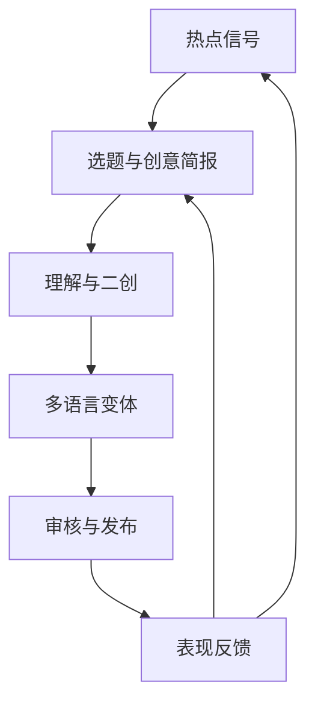

# 总纲：产品、范围与实施路线

## 1. 一句话目标

建设一套“热点驱动、AI 辅助、人工可控、跨平台发布”的视频生产系统：从抖音/TikTok 的热点信号出发，自动形成可解释的选题，完成视频理解、两类二创、中英本地化、质量检查、审核和发布，并用表现数据反哺模板与选题模型。

## 2. 为什么不是简单拼装脚本

下载、转录、配音、剪辑、发布各自已有成熟项目，但它们的共同问题是：

- 数据模型不统一，阶段间依赖目录和临时文件名。
- 无法稳定暂停、恢复、重试和人工插入修改。
- 时间线绑定某个编辑器或 JSON 私有格式。
- 平台接口易变，失败会污染整条链路。
- 生成结果缺少版本、来源、成本和质量证据。
- 很少把发布后的表现反哺到选题和模板。

因此本系统的核心资产应是“领域合同 + 工作流 + 模板/评分 + 质量门”，开源项目作为可替换实现。

## 3. 产品表面

### 3.1 控制中心 Web

- 热点池、选题看板和跨平台聚类
- 账号、模板、素材、Provider、发布计划管理
- 项目进度、成本、错误和重试
- 脚本/字幕/配音/时间线审阅
- 发布日历、状态与效果分析

### 3.2 桌面创作端

- 本地媒体导入、下载、代理文件和缓存
- FFmpeg、OCR、ASR、小模型任务
- 时间线预览与局部重跑
- 本地素材库和 macOS Keychain
- 导出 MP4、OTIO/FCPXML、DaVinci、剪映/CapCut 草稿
- 作为边缘 Worker 接收控制中心任务

### 3.3 服务端控制平面

- 领域 API、身份/权限、任务编排、元数据和对象存储
- 云端 LLM/VLM/TTS/生成式媒体路由
- 平台 OAuth、发布队列、回调和指标采集
- 模板/模型版本、成本和审计

## 4. 核心闭环

## 5. MVP 范围

### 5.1 必须具备

- 抖音/TikTok 热点与指定账号/关键词采集；周期快照和热度排序。
- URL/分享链接导入；可恢复下载；元数据、来源和媒体指纹。
- ASR、OCR、镜头切分、音频/人脸基础分析。
- 输出统一 `VideoBlueprint`：钩子、节拍、镜头、语义、字幕、声音、CTA。
- 两种创作模式：
  - `STRUCTURE_REWRITE`：保留抽象结构，重写事实核验后的新脚本并重新组装素材。
  - `SOURCE_REEDIT`：在授权原片基础上重剪、重排、配音、字幕和版式适配。
- 热门片段候选和理由分数。
- 9:16 模板渲染；中英字幕；中英配音；基础画面文字翻译。
- 可选口型处理，失败时自动回退到切镜/B-roll，不阻塞发布。
- Web/桌面审核，按账号/模板配置自动化等级。
- TikTok/抖音官方发布能力优先；浏览器和 Android 真机作为适配层。
- 发布状态校验、失败重试和基础播放/互动指标回收。

### 5.2 首期不做

- 一开始覆盖六个平台的全部细节。
- 专业 NLE 的完整替代品。
- 从零训练大型生成模型。
- 大规模多租户计费、复杂组织协作。
- 自动解决验证码、风控或登录挑战。
- 以剪映/CapCut 私有草稿格式作为系统核心。
- 承诺所有视频都能达到高质量口型同步。

## 6. 关键架构原则

1. **模块化单体优先**：首期规模小，控制中心采用模块化单体 + 独立媒体 Worker，不拆十几个微服务。
2. **长流程有状态**：采用 Temporal 工作流管理暂停、人审、重试、超时和补偿。
3. **本地优先但非本地锁定**：任务按能力、隐私、成本、时延路由到 Desktop 或 Cloud Worker。
4. **领域对象优先于文件夹**：文件是 Artifact，不能替代 Project、Variant、Timeline 和 PublishJob。
5. **内部时间线是唯一真值**：`CreativeTimeline` 可映射到 OTIO；Remotion/FFmpeg/DaVinci/剪映只是 Renderer/Exporter。
6. **平台连接器可熔断**：每个平台连接器独立版本、健康探针、功能标记和回归样例。
7. **AI 输出必须结构化**：JSON Schema 校验、修复/重试、Prompt/模型/成本可追溯。
8. **可解释评分**：热点、片段、素材匹配和质量评分都返回 reason codes。
9. **先有降级策略再有高级能力**：云模型、口型、生成式视频失败不能拖垮基础成片。
10. **原始事实不可覆盖**：原视频、原转录、原 OCR、来源快照不可变；修改以新版本保存。

## 7. 成功指标

### 7.1 产品指标

| 指标 | MVP 目标 |
|---|---:|
| 从输入链接到首个可审版本 | 10 分钟内（60 秒短视频，不含云视频生成排队） |
| 单个项目局部重跑 | 无需从下载/ASR 重来 |
| 自动流程可恢复率 | 进程重启后 100% 可继续或明确失败 |
| 发布状态可追踪 | 100% PublishJob 有最终状态或人工待办 |
| 新模板人审 | 默认 100% |
| 稳定模板自动发布 | 可按账号开启，保留发布前快照 |

### 7.2 质量指标

| 维度 | 阈值/目标 |
|---|---|
| 音画同步 | 主观无明显漂移；自动检测偏差 P95 ≤ 80 ms |
| 字幕 | 不遮挡人脸/关键 UI；中文 ≤ 16 字/行，英文 ≤ 42 字符/行；CPS 可配置 |
| 未翻译文字 | 可见目标区高置信 OCR 未翻译率 < 2% |
| 黑帧/冻帧/静音 | 通过可配置 QA Gate |
| 热门片段 | Top-3 至少 1 个被人工选择，试点目标 ≥ 70% 项目 |
| 发布前格式 | 平台预检 100% 通过 |

## 8. 分阶段路线

| 阶段 | 目标 | 主要产物 |
|---|---|---|
| P0 地基 | 可运行骨架 | Monorepo、领域合同、Temporal、对象存储、桌面注册、Artifact/Job |
| P1 发现与获取 | 建立热点池 | 抖音/TikTok Connector、快照、排序、下载、指纹、来源 |
| P2 理解 | 形成机器可读蓝图 | ASR/OCR/镜头/人物/音频、VideoBlueprint、可视化检查 |
| P3 二创 | 形成首个可审视频 | 两类创作模式、热门片段、素材规划、时间线、FFmpeg/Remotion |
| P4 本地化 | 生成中英变体 | 字幕、画面文字、TTS、音画同步、可选口型 |
| P5 发布闭环 | 可控发布 | 审核策略、TikTok/抖音发布、状态校验、真机/浏览器兜底 |
| P6 学习闭环 | 数据反哺 | 指标快照、模板表现、热点/片段排序校准 |

## 9. Go / No-Go 决策门

- **P1 → P2**：两个平台的采集/下载连接器均有契约测试、失败分类和手动回退。
- **P2 → P3**：同一输入可重复生成语义等价的 Blueprint，时间戳误差满足样本集要求。
- **P3 → P4**：时间线可重放，FFmpeg 成片与 Remotion 预览的时长差 < 1 帧。
- **P4 → P5**：20 条中英样本通过人工语言与音画 QA，口型失败可自动降级。
- **P5 → P6**：发布幂等，重复回调/重试不会形成重复帖子。

## 10. 推荐团队边界

- 平台/后端：领域、Temporal、存储、账号、发布和可观测性。
- 媒体/AI：分析、时间线、渲染、本地化和质量门。
- 桌面/前端：Tauri、审核 UI、时间线预览、本地 Worker 和凭据。
- 产品/内容：AI/科技模板、热点标注、语言 QA、发布策略和评价集。

首期可由 2–3 名工程师交叉承担，但代码所有权仍按上述边界组织。

