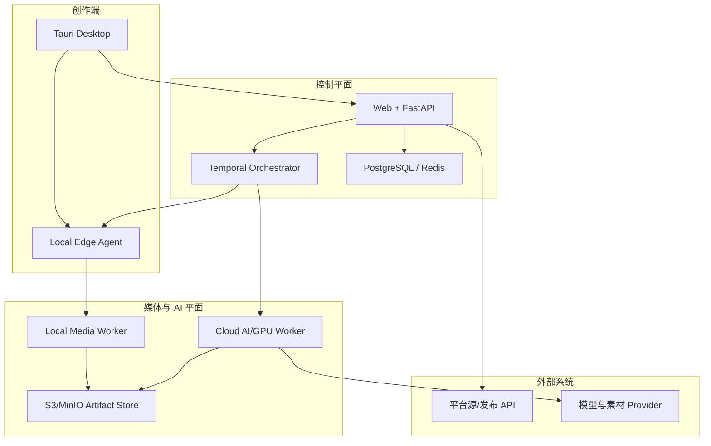

# 系统架构

## 1. 总体拓扑



## 2. 部署单元

### 2.1 Control Plane（Docker Compose）

- `api`：FastAPI 模块化单体，REST/OpenAPI、SSE/WS、Webhooks。
- `web`：Vue 3 + TypeScript 管理台。
- `workflow-worker`：Temporal Workflow/轻 Activity。
- `postgres`：业务数据、Temporal 独立 schema、pgvector。
- `redis`：缓存、限流、短期事件、分布式锁；不作为唯一任务真值。
- `minio`：媒体、分析中间物、渲染、截图、日志包。
- `temporal` + `temporal-ui`：长任务编排。
- 可选 `otel-collector`、Prometheus、Grafana、Loki。

首期允许全部运行在一台 macOS 的 Docker Desktop。生产时可拆到 Linux 主机，但领域代码不变。

### 2.2 Desktop App

- Tauri 2 Rust Shell。
- Vue 3 + TypeScript UI，与 Web 共用组件/领域 SDK。
- `edge-agent`：独立 Sidecar 进程，避免 UI 退出杀死长任务。
- `ffmpeg`/`ffprobe`、Node/Remotion Renderer、Python Media Runtime 作为受版本管理的 Sidecar。
- 本地 Artifact Cache（内容寻址）。
- macOS Keychain Credential Broker。
- 本地预览服务器，只监听 loopback，使用短期令牌。

### 2.3 Cloud AI/GPU Worker

- Python Worker，按能力队列订阅任务。
- 执行 WhisperX、大 VLM、TTS、口型、生成式视频等。
- Provider API 调用与自托管模型使用同一协议。
- 无状态计算；输入输出进入 Artifact Store，状态进入控制平面。

## 3. 为什么采用模块化单体

1–5 个账号、每天不超过 20 条视频时，服务间网络、部署和一致性成本高于收益。控制中心保持一个代码库和一个事务边界，同时用包边界禁止跨域直读表。以下情形才拆服务：

- GPU/媒体任务需要独立扩缩容。
- 平台连接器需要不同运行环境/网络出口。
- 某模块出现独立安全边界或团队所有权。
- 单模块占用资源影响 API SLO。

## 4. 核心组件

### 4.1 API 层

- `/v1/trends`
- `/v1/sources`
- `/v1/projects`
- `/v1/analyses`
- `/v1/creative-briefs`
- `/v1/timelines`
- `/v1/variants`
- `/v1/reviews`
- `/v1/publish-jobs`
- `/v1/accounts`
- `/v1/providers`
- `/v1/workers`
- `/v1/artifacts`

写 API 接受 `Idempotency-Key`；长操作返回 `operation_id/workflow_id`，不保持 HTTP 请求直到结束。

### 4.2 Workflow 层

| Workflow | 作用 | 人工等待点 |
|---|---|---|
| `DiscoverWorkflow` | 周期采集、快照、聚类、排名 | 无 |
| `IngestWorkflow` | URL 解析、下载、探测、代理、指纹 | Cookie/登录 |
| `AnalyzeWorkflow` | ASR/OCR/镜头/VLM、Blueprint | 低置信修订 |
| `CreateWorkflow` | 创意简报、脚本、素材、时间线、渲染 | 脚本/素材审批 |
| `LocalizeWorkflow` | 翻译、画面文字、TTS、同步、口型 | 语言审校 |
| `ReviewWorkflow` | QA、批注、局部重跑、批准 | 必选/按策略 |
| `PublishWorkflow` | 预检、排期、上传、状态、校验 | OAuth/验证码/挑战 |
| `FeedbackWorkflow` | 指标快照、归因、学习信号 | 无 |

Temporal Workflow 代码只做决定和编排；媒体 I/O、模型推理、平台请求全部是 Activity。

## 5. Edge Task Lease 协议

桌面 Worker 不直接暴露入站端口。它向 Control Plane 发起出站连接：

1. `POST /v1/workers/register`，提交设备、OS、CPU/GPU、工具和能力。
2. 每 30 秒 `heartbeat`，上报空闲资源和缓存摘要。
3. 通过长轮询 `POST /v1/worker-tasks/claim` 或 WS 通知领取任务。
4. 任务带 `lease_id`、过期时间、输入 Artifact、输出 Schema、资源限制。
5. Worker 周期续租；超时后任务可被重新分派。
6. 产物先上传到临时对象键，再 `complete` 原子提交哈希。
7. 重复提交按 `task_id + output_digest` 幂等处理。

禁止把平台密码、Cookie 明文放入 Task Envelope；使用短期 `credential_handle`，由桌面 Credential Broker 解封。

## 6. 任务路由

```text
route(task):
  candidates = workers
    .filter(required_capabilities)
    .filter(data_residency)
    .filter(provider_health)
    .filter(resource_budget)

  score = cache_hit*0.30
        + locality*0.25
        + estimated_latency*0.20
        + estimated_cost*0.15
        + reliability*0.10

  return best candidate or configured fallback
```

路由策略可在项目、账号、模板或 Task 上覆盖：`LOCAL_ONLY`、`LOCAL_PREFERRED`、`CLOUD_PREFERRED`、`CLOUD_ONLY`。

## 7. Artifact 模型

对象存储键不应包含业务真值，只便于运维：

```text
artifacts/{tenant_id}/{project_id}/{artifact_id}/{filename}
```

数据库保存：

- SHA-256、可选 pHash/aHash/音频指纹。
- MIME、codec、duration、fps、time_base、dimensions、channels。
- 上游 Artifact、生成 Activity、工具/模型版本。
- 本地/云副本位置与缓存状态。
- 保留策略和敏感级别。

同哈希 Artifact 可去重，但不同来源记录不能合并丢失。

## 8. 时间线架构

### 8.1 三层模型

1. `CreativeTimeline`：系统领域模型，包含语义角色、模板槽位、字幕/配音/人物/来源等扩展字段。
2. `OTIO Mapping`：剪辑顺序、时间范围、媒体引用、Markers、部分 Effects 的交换表示。
3. `Render Graph`：针对 FFmpeg/Remotion 编译出的确定性执行图。

OTIO 本身不保存媒体，也不覆盖所有高级动态效果，因此不可替代 `CreativeTimeline`。

### 8.2 渲染器分工

- FFmpeg：裁剪、拼接、编码、音频、滤镜、遮罩、规范化、最终封装。
- Remotion：动态字幕、信息卡、数据图形、品牌动效、交互预览。
- 浏览器 Player：低清代理和时间线预览。
- Exporter：OTIO、FCPXML、DaVinci Resolve、剪映/CapCut。

## 9. 平台连接器架构

每个平台由多个能力插件组合，而不是一个巨型类：

```text
DiscoveryConnector
MetadataConnector
DownloadConnector
OAuthConnector
PublishConnector
MetricsConnector
BrowserAutomationConnector
DeviceAutomationConnector
```

能力描述示例：

```json
{
  "platform": "tiktok",
  "capability": "publish.video",
  "mode": "official_api",
  "status": "healthy",
  "supports_schedule": false,
  "requires_app_review": true,
  "max_file_size_mb": 4096,
  "version": "2026-07-19"
}
```

连接器必须提供：契约测试夹具、限流器、错误映射、回退路径、最后成功时间和一键禁用。

## 10. 安全设计

- Control Plane：OIDC/本地账号、短期 Access Token、RBAC。
- 平台 OAuth Token：服务端 envelope encryption；本地账号 Cookie 进入 Keychain。
- Artifact：预签名 URL 最短有效期，按项目/任务限定。
- Sidecar：固定版本、校验和、签名清单；禁止任意 shell 字符串。
- FFmpeg 命令：参数数组执行，路径白名单，限制协议和输入大小。
- 浏览器：账号隔离 Profile，发布域名白名单，所有提交动作审计。
- Android：设备绑定、ADB 指纹、锁屏检测、截图证据、单账号串行。
- Webhook：签名验证、重放保护、原始 Body 保存。

## 11. 可观测性

每个日志/Span 包含：`tenant_id`、`project_id`、`workflow_id`、`task_id`、`provider`、`attempt`；不记录 Secret。

关键指标：

- Workflow 成功率/耗时/重试分布。
- Provider 成功率、P95、单位成本、限流。
- 平台 Connector 最近成功时间与契约测试状态。
- Worker 心跳、队列、缓存命中、磁盘水位。
- 每条视频各阶段耗时、成本和 QA 失败原因。
- 发布成功率、重复发布阻止数、人审等待时长。

## 12. 故障与恢复

| 故障 | 行为 |
|---|---|
| Desktop 离线 | Lease 超时；Workflow 等待或路由云 Worker；恢复后继续 |
| Provider 超时 | 指数退避 + 抖动；熔断；按策略切换 Provider |
| 平台结构变化 | Connector 健康失败；禁用相关能力；进入人工导入/发布 |
| 对象上传中断 | 分片/断点；临时对象不登记为完成 Artifact |
| AI JSON 无效 | Schema 修复一次，再换模型/提示；保存原响应 |
| 渲染失败 | 定位失败 Segment；复用上游缓存局部重跑 |
| 发布结果未知 | 状态查询/外部内容去重；确认前不盲目重发 |
| 进程/主机重启 | Temporal + DB 恢复；Activity 以幂等键重放 |

