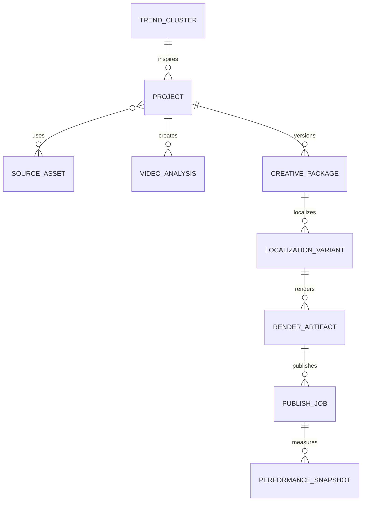
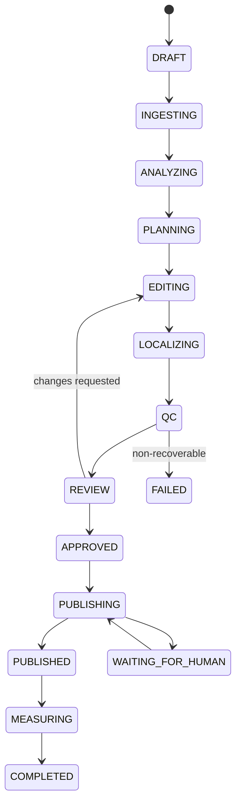
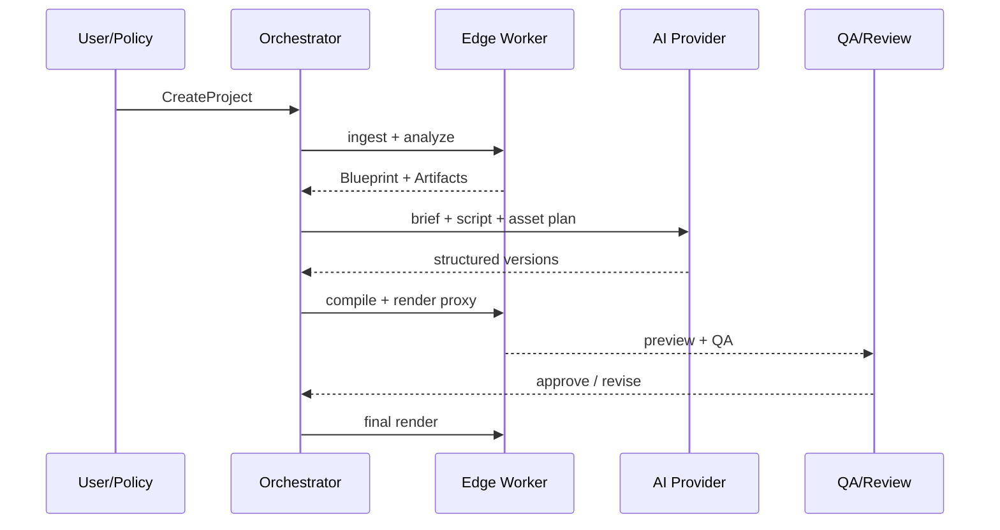

# 领域模型与工作流

## 1. 聚合根

### 1.1 `TrendCluster`

将同一事件/主题在不同平台、不同视频和不同语言下的信号聚成一组。

关键字段：

```text
id, title, canonical_topic, keywords[], entities[]
platform_items[], first_seen_at, last_seen_at
velocity, acceleration, engagement_efficiency
cross_platform_score, novelty, saturation, decay
topic_fit, source_confidence, hot_score
reason_codes[], embedding_ref, snapshot_ids[]
```

### 1.2 `Project`

一条创作任务的业务根：

```text
id, title, vertical, source_language, target_languages[]
creation_mode, trend_cluster_id?, source_asset_ids[]
channel_profile_id, template_version_id
status, workflow_id, budget_policy, execution_policy
```

### 1.3 `VideoBlueprint`

对参考视频抽象后的可机器消费结构，不包含“照搬原表达”的指令：

```text
hook: type, promise, duration
beats[]: purpose, time_range, claims, emotion, visual_role
shots[]: time_range, scene_type, motion, subjects, text_refs
speech[]: speaker, words, time_range, confidence
on_screen_text[]: track, bbox, text, language, time_range
audio_profile: speech, music, sfx, bpm, loudness
caption_style, pacing_profile, cta, aspect_ratio
```

### 1.4 `CreativePackage`

由以下版本对象组成：

- `CreativeBrief`
- `ScriptVersion`
- `AssetPlan`
- `TimelineVersion`
- `LocalizationVariant[]`
- `RenderArtifact[]`
- `QCReport[]`
- `ReviewDecision[]`

### 1.5 `PublishJob`

```text
id, project_id, variant_id, render_id
account_id, platform, connector_mode
scheduled_at, status, idempotency_key
metadata_snapshot, attempts[], external_post_id?
review_decision_id, preflight_report_id
```

## 2. 关系图



## 3. Project 状态机



`FAILED` 不是删除；修复配置后可创建新 Workflow Run，从最近有效 Checkpoint 继续。

## 4. 创建工作流



## 5. 两种二创模式

### 5.1 `STRUCTURE_REWRITE`

允许继承：

- 钩子类型、信息节拍、时长分布、镜头功能、字幕节奏、CTA 类型等抽象结构。

必须重新生成：

- 事实表述、句子、旁白、画面、音乐、品牌和最终编排。

流程：Blueprint → Claims/事实核验 → 新角度 → Beat Sheet → 新脚本 → 新素材计划 → Timeline。

### 5.2 `SOURCE_REEDIT`

流程：选取授权原片段 → 去冗余/静音 → 重排 → 新旁白/字幕 → B-roll/卡片 → 竖屏重构图 → 可选画面文字清理 → Timeline。

同一 Project 可同时生成两种 Package，供 A/B 选择。

## 6. 审核策略

```yaml
review_policy:
  mode: NEW_TEMPLATE_ONLY # ALWAYS | NEW_TEMPLATE_ONLY | AUTO
  require_when:
    qc_severity_at_least: warning
    new_template_version: true
    new_account: true
    connector_mode_in: [browser, android_device]
    cost_over_usd: 5
  trusted_template:
    minimum_approved_renders: 20
    maximum_recent_failure_rate: 0.02
```

发布时保存审核策略快照，避免策略后来改变导致历史不可解释。

## 7. 事件目录

| 事件 | 生产者 | 主要消费者 |
|---|---|---|
| `TrendClusterUpdated` | Trend | Web、Planning |
| `SourceAssetReady` | Acquisition | Analysis |
| `VideoBlueprintReady` | Understanding | Planning、Review |
| `ScriptVersionCreated` | Planning | Asset Resolver、Review |
| `TimelineCompiled` | Editing | Render、QA、Export |
| `LocalizationVariantReady` | Localization | QA、Review |
| `QCCompleted` | QA | Review/Workflow |
| `VariantApproved` | Review | Publishing |
| `PublishStatusChanged` | Publishing | Calendar、Analytics |
| `PerformanceSnapshotCaptured` | Analytics | Ranking、Template Learning |

事件经事务 Outbox 发布，消费者必须以 `event_id` 去重。

## 8. Schema 演进

- 所有外部可持久 JSON 有 `schema_version`。
- Reader 至少兼容当前与前一版；迁移采用显式 Upcaster。
- 模型 Prompt 绑定输出 Schema 版本。
- Artifact Manifest 不就地升级；生成新版 Manifest 并指向原 Artifact。
- Timeline Exporter 声明能处理的 `CreativeTimeline` 版本范围。

## 9. 成本与预算

每个 Activity 写入：

```text
provider, model, input_units, output_units
gpu_seconds, cpu_seconds, bytes_in/out
estimated_cost, currency, pricing_version
```

预算策略可在预计超限前暂停：`WAITING_FOR_BUDGET_APPROVAL`。优先降级顺序：生成式视频 → 口型 → 大 VLM → 高价 TTS；不应以降低来源/发布安全性换成本。

