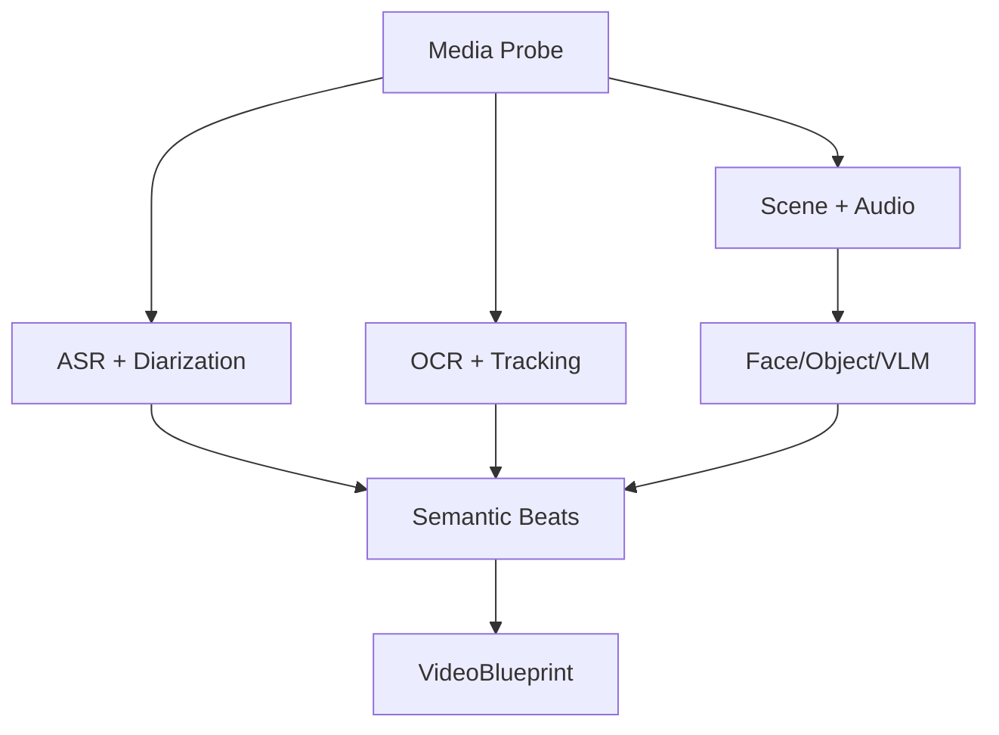

# M02–M03：视频获取、去重与 AI 拆解

## 1. 获取层目标

将平台链接、榜单项或本地文件变为可重复分析的 `SourceAsset`，同时把平台易变性封装在 Connector 内。

## 2. 获取 Provider 优先级

### 抖音

1. 官方/用户授权可得的媒体或分享能力。
2. `f2` Adapter。
3. 浏览器已登录会话中的下载/网络响应 Adapter。
4. 手工导入本地原片。

### TikTok

1. 官方允许的导出/授权路径。
2. `yt-dlp` Adapter。
3. `f2`/TikTok-Api Adapter。
4. 浏览器/手工导入。

`TikTokDownloader/DouK` 仅作为接口研究样本，不进入 MVP 运行依赖。

## 3. IngestWorkflow

1. `ResolveSource`：展开短链，识别平台和内容 ID。
2. `FetchMetadata`：保存标准字段和原始响应 Artifact。
3. `AcquireMedia`：断点续传到临时路径。
4. `ProbeMedia`：ffprobe 验证容器、流、时基、时长。
5. `NormalizeInput`：必要时生成 mezzanine/proxy，不覆盖原文件。
6. `Fingerprint`：SHA-256、视频 pHash 序列、音频指纹。
7. `Deduplicate`：识别同文件、同内容不同转码、近似片段。
8. `PersistProvenance`：来源、账号、抓取时间、连接器、声明。
9. `Emit SourceAssetReady`。

## 4. 媒体规格

保留三类 Artifact：

- `ORIGINAL`：原始下载/导入，不修改。
- `MEZZANINE`：统一可编辑中间格式；首期可用 H.264 Intra 较高码率或 ProRes Proxy/422，按磁盘策略选择。
- `PROXY`：720p/低码率预览，保持准确时长和时基。

音频另提取：48kHz WAV/FLAC 用于 ASR/分析；不要在每个模块重复解码 MP4。

## 5. 去重

| 层级 | 方法 | 用途 |
|---|---|---|
| 文件 | SHA-256 | 完全相同 |
| 视频 | 每 N 秒 pHash + DTW/MinHash | 不同转码、加边框、轻裁剪 |
| 音频 | Chromaprint/声纹摘要 | 同音轨/搬运版本 |
| 文本 | ASR/OCR SimHash/Embedding | 同脚本不同画面 |
| 片段 | Scene/音频窗口指纹 | 素材复用和近似片段 |

去重只建立 `duplicate_group_id` 和相似度，不删除任何来源记录。

## 6. AnalysisWorkflow



并行运行 B/C/D，待基础结果完成后再做 VLM 选择性采样和语义融合。

## 7. ASR 与说话人

### 7.1 Provider 路由

- macOS 本地快速稿：`whisper.cpp` 或轻量 `faster-whisper`。
- 精确词级时间：WhisperX Cloud/GPU Worker。
- 中文热点词：FunASR/FunClip Provider，可注入产品名/人名热词。
- 混合语言：先做语言片段检测，分别转写/对齐，避免单一强制对齐模型吞掉另一语言。

### 7.2 输出

```json
{
  "segments": [{
    "start_ms": 120,
    "end_ms": 2480,
    "speaker_id": "spk_0",
    "language": "zh-CN",
    "text": "……",
    "confidence": 0.93,
    "words": [{"text": "…", "start_ms": 120, "end_ms": 310, "confidence": 0.91}]
  }]
}
```

保存 VAD、对齐和说话人模型版本；低置信词进入审核标记。

## 8. OCR 与文字跟踪

流程：

1. 关键帧 + 场景切换附近帧采样。
2. 文本检测和识别。
3. 用 IoU、外观和光流把区域聚成 `TextTrack`。
4. 区分字幕、标题、UI、品牌/水印、场景内文字。
5. 用多帧投票提升识别。
6. 输出时间范围、四边形/bbox、遮挡、运动、置信度和样式提示。

`TextTrack.kind`：`CAPTION`、`TITLE`、`LOWER_THIRD`、`UI`、`SCENE_TEXT`、`BRAND_MARK`、`UNKNOWN`。

## 9. 镜头、画面与音频

- Scene Detection：内容切换、渐变、闪白分别处理。
- Shot Feature：运动强度、镜头类型、主体位置、清晰度、曝光、画面可用区。
- Face Track：bbox、landmarks、visible、speaking probability、身份聚类。
- Object/UI：手机、电脑、产品、屏幕录制、代码、图表等 AI/科技模板相关标签。
- Audio：响度、静音、音乐/语音/SFX、BPM/节拍、情绪和重叠语音。
- VLM 只分析代表帧/低置信片段，避免逐帧云成本。

## 10. VideoBlueprint 生成

### 10.1 事实层与表达层分开

- `claims[]`：视频中可核验陈述、实体、来源状态。
- `rhetorical_beats[]`：钩子、问题、证据、对比、演示、结论、CTA。
- `visual_beats[]`：人物、屏录、产品、B-roll、图卡等功能。

后续结构重写只消费抽象节拍和经核验 Claims，不能把完整转录直接当“改写提示词”。

### 10.2 结构化输出与校验

- JSON Schema 强校验。
- 时间区间必须单调、在媒体时长内。
- Beat 覆盖率目标 ≥ 90%，允许明确的 `UNCLASSIFIED`。
- Claim 必须引用 transcript/OCR 的 evidence spans。
- LLM 不能创建不存在的时间戳；时间范围由程序提供候选。

## 11. 缓存与局部重跑

Activity Cache Key：

```text
sha256(input_artifact_digest + provider + model_version
       + normalized_config + schema_version)
```

修改字幕不重跑下载/镜头；修改 OCR 模型只重跑 OCR 和下游融合；更换 Blueprint Prompt 不重跑 ASR/OCR。

## 12. 错误分类

- `SOURCE_UNAVAILABLE`
- `AUTH_REQUIRED`
- `RATE_LIMITED`
- `CONNECTOR_SCHEMA_CHANGED`
- `DOWNLOAD_INCOMPLETE`
- `MEDIA_CORRUPT`
- `UNSUPPORTED_CODEC`
- `ASR_LOW_CONFIDENCE`
- `OCR_LOW_COVERAGE`
- `ALIGNMENT_FAILED`
- `BLUEPRINT_SCHEMA_INVALID`

错误类别决定重试、切 Provider、人工输入还是终止，禁止只返回字符串堆栈。

## 13. 验收

- 50 条抖音/TikTok 样本中，可解析/可人工回退率 100%；自动成功率以试点记录建立基线。
- 中断后继续下载不产生重复 SourceAsset。
- 同视频不同转码能聚入同 duplicate group。
- 20 条中英样本的词级时间人工抽样中位误差 ≤ 120 ms。
- OCR Track 在镜头内稳定，不因每帧轻微位移产生多个对象。
- Blueprint 的每个 Claim/Beat 可回跳到证据时间点。

