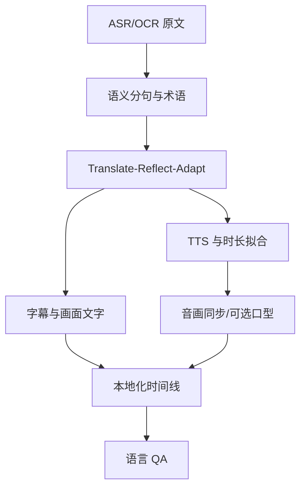

# M08：中文 ↔ 英文多语言适配

## 1. 目标

本地化不是“翻译字幕后换一条音轨”，而是对语义、屏幕文字、字幕阅读速度、说话人声音、句长、镜头和口型的联合适配。输出每种语言独立的 `LocalizationVariant`，共享 Canonical Script 和基础 Timeline。

## 2. Pipeline



## 3. Canonical Script

每句包含：

```text
sentence_id, beat_id, speaker_id
source_text, semantic_intent, claims[]
source_time_range, target_duration_ms
must_keep_terms[], pronunciation_hints[]
visual_dependencies[], edit_flexibility
```

翻译修改不直接覆盖 Canonical Script，而是创建 `LocalizedSentence`。

## 4. Translate → Reflect → Adapt

### 4.1 Translate

- 忠实传达事实和语义。
- 术语表锁定产品名、模型名、数值和单位。
- 保留 Claim 引用。

### 4.2 Reflect

- 检查漏译、添加事实、代词指向、数值、否定和因果。
- 对中英文化表达和平台文风提出修改，但不直接提交。

### 4.3 Adapt

- 在不改变 Claims 的前提下，控制语速、句长、钩子和口语自然度。
- 为目标时长生成 A/B 候选。
- 输出 `semantic_similarity`、`duration_estimate`、`changed_claims`。

若模型报告 `changed_claims != []`，必须进入人工审核。

## 5. 字幕设计

### 5.1 分段

- 以语义短语、停顿和词级时间为边界。
- 不拆产品名、数字+单位、否定结构和短语动词。
- 中文默认每行不超过 16 个汉字；英文默认 42 字符，可由模板覆盖。
- 最多 2 行；首期短视频默认单行优先。
- 阅读速度限制：中文字符/秒、英文 CPS/WPM 分开配置。

### 5.2 对齐

- 原声字幕跟随 ASR 词级时间。
- 配音字幕跟随 TTS 生成后的 forced alignment，不复用原时间。
- Karaoke/逐词高亮只在词级置信度达标时启用。

### 5.3 安全区

考虑抖音/TikTok UI 覆盖、人物脸、关键产品 UI；字幕布局由每帧 `occupied_regions` 求解，不只固定底部坐标。

## 6. 画面文字翻译

### 6.1 TextTrack 策略

| 类型 | 默认行为 |
|---|---|
| CAPTION | 删除/覆盖原字幕，渲染目标字幕 |
| TITLE/LOWER_THIRD | 清理原文字并按原/模板风格重绘 |
| UI | 视内容决定保留、标注或局部翻译；避免伪造产品界面 |
| SCENE_TEXT | 重要则翻译为贴片/旁注；不重要可保留 |
| BRAND_MARK | 不作为普通翻译文字；按素材授权/品牌策略处理 |

### 6.2 重绘

- 从多帧估计背景，或用授权清理 Pipeline 生成 Clean Plate。
- 目标语言文案先做布局测量，必要时缩短而非无限缩小字号。
- 追踪位置/透视/旋转/遮挡；保留进出场。
- 无法高质量修复时使用品牌化信息卡覆盖或切 B-roll。

## 7. TTS Provider

协议：

```text
synthesize(text, language, voice_ref, style, target_duration,
           pronunciation_lexicon, seed) -> AudioArtifact + WordTimings
```

首期 Provider：

- 云端高质量 TTS 作为默认。
- CosyVoice/GPT-SoVITS 类能力作为可插拔自托管/云 Worker。
- macOS 系统/轻量 TTS 仅做低成本预览降级。

声音复刻必须有明确 Voice Profile；每个 Voice Profile 记录样本来源和授权状态。没有可用复刻时用频道预设合成声。

## 8. 时长拟合

按以下顺序解决目标语言比原句长/短：

1. LLM 改写更短/更长，但 Claim 不变。
2. TTS 语速在自然区间微调（建议 0.92–1.08，模板可配置）。
3. 调整相邻 B-roll、停顿和镜头 Hold。
4. 对非人脸镜头做小幅时间伸缩。
5. 仍超限则重排 Beat/增加切镜；禁止极端压速。

每句记录 `fit_method` 和最终伸缩比。

## 9. 音频合成

- 原声/配音、音乐、SFX 分轨。
- 配音段做 De-esser、EQ、压缩、响度匹配和 Room Tone。
- 原片有说话但替换配音时，可用人声分离降低原声；保留环境声。
- Ducking 以语音活动为 sidechain，避免每个切点泵动。
- 最终目标响度按平台/模板配置；True Peak Gate 必须通过。

## 10. 口型同步

### 10.1 只对适合的片段运行

资格：

- 单个主要正/侧脸、面部尺寸足够、遮挡小。
- Face Track 与 speaker 概率高。
- 片段时长和转头幅度在模型支持范围。
- 目标配音已最终对齐。

### 10.2 Provider 与回退

- GPU LipSync Provider（MuseTalk 类）生成局部脸区。
- 合成后做边界、肤色、运动和身份一致性 QA。
- 失败回退顺序：选用原口型相近 Take → 插 B-roll/屏录 → 加快切镜 → 保留非口型配音。

口型不是阻塞性能力；`lip_sync_mode`：`OFF`、`AUTO_ELIGIBLE`、`FORCE_REVIEW`。

## 11. 音画同步

- Timeline 采用整数帧与整数音频采样换算，避免累计浮点漂移。
- 对每个配音句保存 speech onset、word timings、目标镜头范围。
- 完成后对成片重新提取音频/帧进行同步测量，而不是相信中间时间线。
- 总时长、帧数、音频采样数建立一致性断言。

## 12. 语言 QA

自动检查：

- 源/目标 Claim 数、数字、专名和否定一致。
- 术语表和读音。
- 未翻译 TextTrack。
- 字幕行长、CPS、重叠和安全区。
- TTS 空白、重复、截断、音量、爆音。
- 句级时长超限、极端变速。
- 人脸段口型/音频粗同步。

人工界面：原文、直译、适配稿、音频波形、视频时间点并排；批准可针对句子而不是整条视频。

## 13. 验收

- 20 条 AI/科技中英样本，数字/产品名/否定事实一致率 100%。
- 字幕 100% 通过安全区和阅读速度自动规则，人工可一键定位例外。
- 高置信目标文字未翻译率 < 2%。
- 句级配音无截断，成片音画偏差 P95 ≤ 80 ms。
- 口型失败能自动降级并形成警告，不导致 Workflow 永久失败。
- 修改单句译文只重跑该句 TTS、相关字幕/口型和下游渲染。

